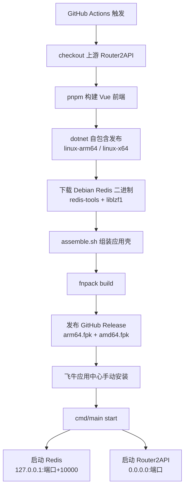

# Router2API 飞牛 fnOS 原生应用

把 [Router2API](https://github.com/NNNNolan/Router2API)（.NET 10 模型路由宿主）打包成**飞牛 fnOS 原生应用**（`.fpk`，非 Docker），并通过 GitHub Actions 自动跟进上游更新重新打包。

## 这个项目做什么

上游 Router2API 是一个模型路由网关，把不同提供方的模型统一成 OpenAI 兼容接口，自带 Vue 3 管理后台。它原本以 Docker 方式分发，本项目把它做成飞牛应用中心的原生安装包：

```
用户下载 Router2API_v2.0.0_arm64.fpk
        ↓
飞牛应用中心手动安装
        ↓
自动解压到 /var/apps/Router2API/target/
        ↓
执行 cmd/main start → 拉起内置 Redis + .NET 宿主
        ↓
浏览器访问 http://<NAS地址>:5242/  → 管理后台
```

## 为什么要做这些额外处理

上游是给 Docker 设计的，直接搬到飞牛上有三个坑，本项目逐个解决：

| 问题 | 原因 | 本项目的做法 |
|------|------|--------------|
| **飞牛没有 dotnet 运行时** | 应用中心的依赖包里只有 nodejs / python / java，没有 .NET | 用 .NET **自包含发布**（`--self-contained true`），把运行时打进包里 |
| **Redis 是硬依赖** | 上游源码明确：代理池冷却「node state has no memory fallback」，Redis 不可用时代理选择直接抛错 | 从 Debian 提取 **redis-server 二进制打进包内**，启动时自动拉起，只监听 `127.0.0.1` |
| **升级会丢数据** | 上游按「当前工作目录」读 `Config/Config.json`、按「程序目录」找 `plugins/`，这两处都在 `target/` 里，升级会被整包替换 | 把工作目录设为 **var 目录**，插件目录软链到 var，升级不丢密码、密钥、数据库和插件 |

## 目录结构

```
Router2API/
├── .github/workflows/build.yml    # GitHub Actions：拉上游源码 → 构建 → 打包 → 发 Release
├── appshell/                      # 飞牛应用壳（与上游源码无关的固定部分）
│   ├── manifest                   # 应用元数据（名称、版本、端口、入口）
│   ├── cmd/                       # 9 个生命周期脚本（少了 fnpack 会拒绝打包）
│   │   ├── main                   # ★ 核心：启停 Redis 与 .NET 宿主
│   │   ├── install_init           # 安装前：检查包体完整性与端口占用
│   │   ├── install_callback       # 安装后：建目录、修权限
│   │   ├── upgrade_init/_callback # 升级前后
│   │   ├── uninstall_init/_callback
│   │   └── config_init/_callback  # 应用设置里改配置时
│   ├── config/privilege           # 以专用用户运行（run-as: package）
│   ├── config/resource            # 申请一个共享目录
│   ├── wizard/install, upgrade    # 安装/升级向导（端口、账号密码、API Key）
│   ├── ui/config                  # 桌面入口配置
│   ├── ui/images/                 # 入口图标
│   └── ICON.PNG, ICON_256.PNG     # 应用图标
├── scripts/assemble.sh            # ★ 核心：把上游构建产物装进应用壳
├── docs/BUILD.md                  # 构建与发布详解
└── docs/DESIGN.md                 # 设计原理与踩坑记录
```

## 快速开始

### 1. 推到自己的 GitHub 仓库

```bash
git init
git add .
git commit -m "Router2API fnOS 打包"
git remote add origin https://github.com/<你的用户名>/Router2API-fnos.git
git push -u origin main
```

### 2. 触发构建

三种方式任选：

- **自动**：push 到 `main` 后自动开始
- **手动**：仓库 → Actions → build → Run workflow
- **定时**：每天北京时间凌晨 4 点检查上游是否有新版本，有才构建

### 3. 下载安装

构建完成后到 Releases 页面下载对应架构的 fpk：

- `Router2API_v2.0.0_arm64.fpk` —— ARM 架构 NAS
- `Router2API_v2.0.0_amd64.fpk` —— x86_64 架构 NAS

然后：**飞牛桌面 → 应用中心 → 手动安装 → 上传 fpk**

### 4. 访问

装好后点桌面 Router2API 图标，或浏览器打开 `http://<NAS地址>:<你设置的端口>/`。

**默认登录账号密码都是 `admin`。** 这是弱密码，只适合内网，登录后请立刻在「设置」页改掉。

> 如果升级时忘了密码：升级向导里密码留空表示"保持不变"；
> 真要重置，删掉 `<var>/Config/Config.json` 重启，会重新生成 admin/admin。

## 架构说明



## 数据存放位置

| 内容 | 位置 | 升级是否保留 |
|------|------|--------------|
| 配置（密码、API Key） | `<var>/Config/Config.json` | ✅ |
| SQLite 数据库 | `<var>/data/router2api.db` | ✅ |
| 已安装插件 | `<var>/plugins/` | ✅ |
| Redis 数据 | `<var>/redis/` | ✅ |
| 运行日志 | `<var>/logs/` | ✅ |
| 程序本体 | `<target>/host/`、`<target>/redis/` | ❌ 升级时替换（正常） |

`<var>` 即飞牛的 `/vol{n}/@appdata/Router2API`，在文件管理里能看到。

## 常用排查

日志文件：`<var>/logs/Router2API.log` 与 `<var>/logs/redis.log`

| 现象 | 排查方向 |
|------|----------|
| 启动失败：主程序缺失 | fpk 里的 `app/host` 没打进去，看 CI 的 assemble 日志 |
| 启动失败：Redis 启动失败 | 看 `<var>/logs/redis.log`；确认架构匹配（arm64/x86 别装错） |
| 端口被占用 | 应用设置里换端口，或在飞牛里查谁占了端口 |
| 页面打开空白 | 确认 `cmd/main status` 是运行中；看日志有没有异常 |
| 忘了管理员密码 | 删掉 `<var>/Config/Config.json` 重启，会重置为默认 admin/admin |
| 想重置 API Key | 管理后台「设置」页可查看与重置 |

## 授权

应用壳与打包脚本跟随上游 [MIT License](https://github.com/NNNNolan/Router2API/blob/main/LICENSE)。
包内 Redis 二进制来自 Debian 打包，遵循 Redis 自身的 RSALv2 / SSPLv1 双许可，详见 `app/redis/README.txt`。
