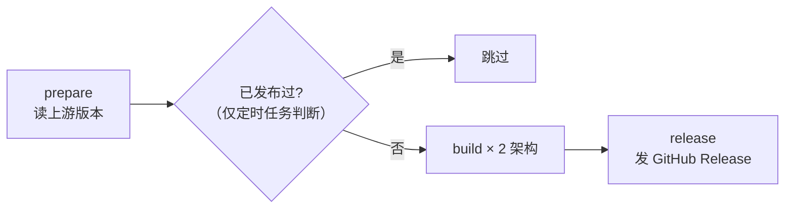

# 构建与发布指南

> 所有构建都在 GitHub Actions 上完成，NAS 本机只负责安装，不占用 CPU / 内存。

## CI 流程



### prepare

- checkout 上游 `NNNNolan/Router2API`
- 从 `src/Router.Contracts/Router.Contracts.csproj` 的 `<Version>` 读版本号
- 只有**定时任务**才做「版本已发布过就跳过」的检查；push 和手动触发一律构建

> 为什么 push / 手动触发不跳过：打包脚本本身可能改了（比如修了个安装问题），
> 版本号没变也需要重新出包，用 `--clobber` 覆盖同名 Release 资产。

### build（matrix 双架构）

并行跑两个 runner：

| 架构 | runner | fnpack | .NET RID |
|------|--------|--------|----------|
| arm64 | `ubuntu-24.04-arm` | 1.2.1-linux-arm64 | `linux-arm64` |
| amd64 | `ubuntu-latest` | 1.2.3-linux-amd64 | `linux-x64` |

用**原生架构 runner** 而不是交叉编译，因为 .NET 自包含发布里的原生库
（SQLite、OpenSSL 相关）必须与目标架构一致，原生构建最省心。

单个 runner 的步骤：

1. checkout 本仓库（应用壳）+ 上游（源码）
2. 装 .NET 10 SDK、Node.js 24、开 corepack
3. 下载 fnpack
4. 跑 `scripts/assemble.sh`（见下）
5. `fnpack build`，把输出改名为 `Router2API_v<版本>_<架构>.fpk`
6. 上传 artifact

### release

两个架构都成功后才发布，避免出现「只发了一半」的版本。

## assemble.sh 做什么

按顺序：

| 步骤 | 内容 | 为什么需要 |
|------|------|-----------|
| 1 | 建组装目录 | — |
| 2 | 复制应用壳，把版本号写进 manifest | 应用壳是固定的，版本随上游变 |
| 3 | `pnpm install --frozen-lockfile && pnpm build` | 上游前端是独立 pnpm 工程，构建后会同步到 `src/Router.Host/wwwroot` |
| 4 | `dotnet publish -r <RID> --self-contained true` | 飞牛没有 dotnet 运行时，必须自带 |
| 5 | 下载 Debian 的 `redis-tools` + `liblzf1`，提取二进制 | 飞牛没有 redis 依赖包 |
| 6 | 清软链、统一权限、校验 | 飞牛安装器对软链敏感 |

### 第 3 步细节：前端

上游 `web/package.json` 用 `pnpm build` 串联：

```
vue-tsc --noEmit              # 类型检查
vite build                    # 打包，同时生成 .gz / .br 预压缩文件
node scripts/sync-host-wwwroot.mjs   # 把 web/dist 同步到 src/Router.Host/wwwroot
```

最后一步很关键：`dotnet publish` 只会带 `wwwroot` 里的内容，
不跑这个同步脚本的话，打出来的包管理后台是空白的。

### 第 4 步细节：自包含发布

```bash
dotnet publish src/Router.Host/Router.Host.csproj \
    -c Release -r linux-arm64 --self-contained true \
    -o app/host
```

产物里会有一个 `Router.Host` 可执行文件（apphost）和完整的 .NET 运行时，
体积约 100 MB。启动脚本优先用它，找不到才退回 `dotnet Router.Host.dll`。

### 第 5 步细节：Redis

**这是本项目最关键的适配点。**

上游对 Redis 是硬依赖。源码 `PluginProxyRuntime.cs` 里明确写着：

```csharp
// Any Redis error escapes here: node state has no memory fallback.
var state = await proxyPolicy.GetAsync(pluginKey, proxy, cancellationToken);
```

也就是说 Redis 不可用时，代理选择会直接抛异常，不是「降级成直连」。

飞牛应用中心没有 redis 依赖包，所以从 Debian 提取二进制随包分发：

- `redis-tools_7.0.15-1~deb12u7_<arch>.deb` → 里面才有真正的 `redis-server` 实体
  （`redis-server` 包里的 `/usr/bin/redis-server` 只是个指向 `redis-check-rdb` 的软链）
- `liblzf1_3.6-4+b4_<arch>.deb` → Redis 的 LZF 压缩依赖，**飞牛系统本身不带这个库**

`redis-server` 其实是 `redis-check-rdb` 改名而来的多调用二进制（按 `argv[0]` 决定行为），
启动脚本设置 `LD_LIBRARY_PATH` 指向包内 `redis/lib` 即可。

**版本固定为 7.0.15**，不动态挑最新版。原因：Debian 池里混着不同发行版编译的包，
飞牛是 Debian 12（GLIBC 2.36），而 trixie 编译的 Redis 8.x 需要 GLIBC 2.38，
装上会报 `version 'GLIBC_2.38' not found` 根本跑不起来。
7.0.15 最高需要 GLIBC_2.34，实测兼容。

> 版本号写在 `assemble.sh` 顶部的 `REDIS_VERSION`，真要换只改这一行。
> 注意要选 bookworm 系列（`~deb12uN` 后缀）的包，别选成 trixie 的。

> 以上都是在本机（飞牛 arm64 / Debian 12）实测确认的：
> 直接用 `redis-server` 包里的软链会失败，缺 `liblzf.so.1` 会报
> `error while loading shared libraries`。

### 第 6 步细节：软链与权限

飞牛安装器会对 `app.tgz` 递归执行 `ApplyPermission`。实测软链会导致
`ErrCodeInstallDirAuthException(10234) 设置目录权限失败`，所以：

- 有效软链 → 复制目标内容实体化
- 断链 → 直接删除
- 目录 755、文件 644，可执行文件显式 755

## 本地手动构建（可选）

本机需要 .NET 10 SDK、Node 24、pnpm、fnpack、dpkg-deb：

```bash
# 1. 准备上游源码
git clone --depth 1 https://github.com/NNNNolan/Router2API.git upstream

# 2. 组装（把 <arch> 换成 arm64 或 amd64）
STAGE_DIR="$PWD/stage" \
UPSTREAM_DIR="$PWD/upstream" \
R2A_VERSION="2.0.0" \
R2A_ARCH="arm64" \
  bash scripts/assemble.sh

# 3. 打包
cd stage/Router2API && fnpack build
# 产物：Router2API.fpk（记得自己改名为带版本号和架构）
```

## 更新 fnpack 版本

飞牛官方的 fnpack 是静态二进制，地址规律：

```
https://static2.fnnas.com/fnpack/fnpack-<版本>-linux-<amd64|arm64>
```

改 `.github/workflows/build.yml` 里 `FNPACK_URL` 两行即可。
注意 arm64 与 amd64 的可用版本不一定同步（实测 arm64 最高 1.2.1，amd64 有 1.2.3）。

## 更新上游版本追踪方式

如果上游改了版本号声明方式（比如挪到 `Directory.Build.props`），
改 `prepare` job 里的这行正则即可：

```bash
VERSION=$(grep -oPm1 '(?<=<Version>)[^<]+' upstream/.../Router.Contracts.csproj || true)
```

读不到时会回退成日期版本，保证构建不中断。
