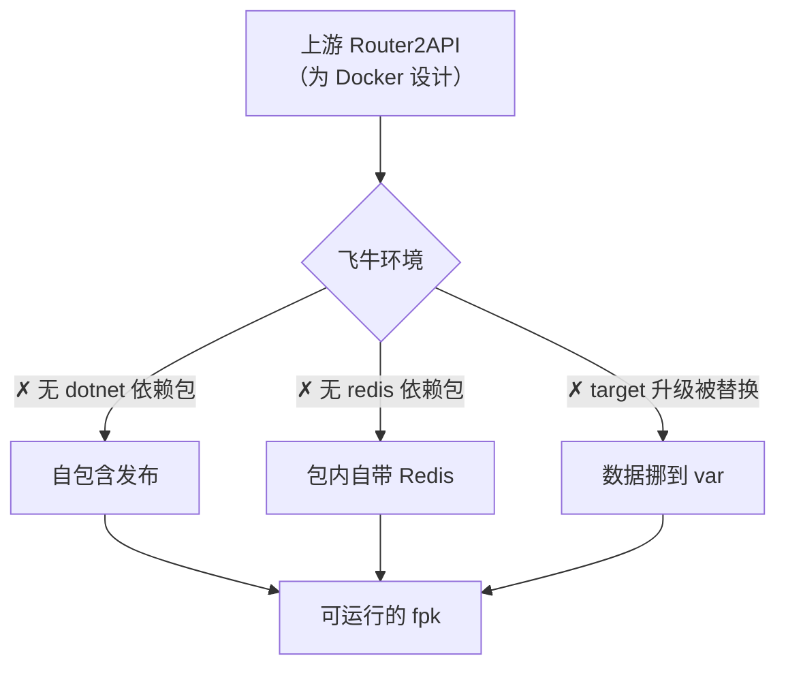
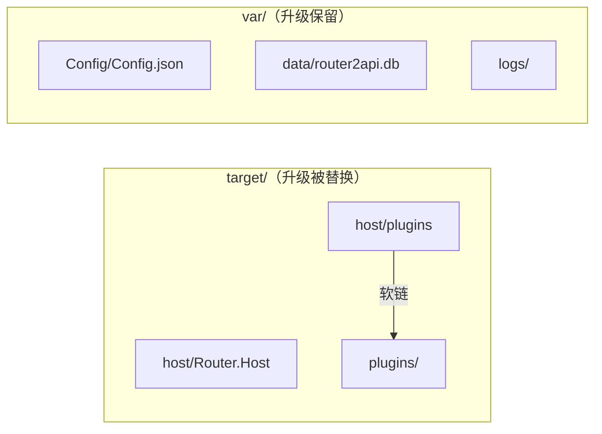
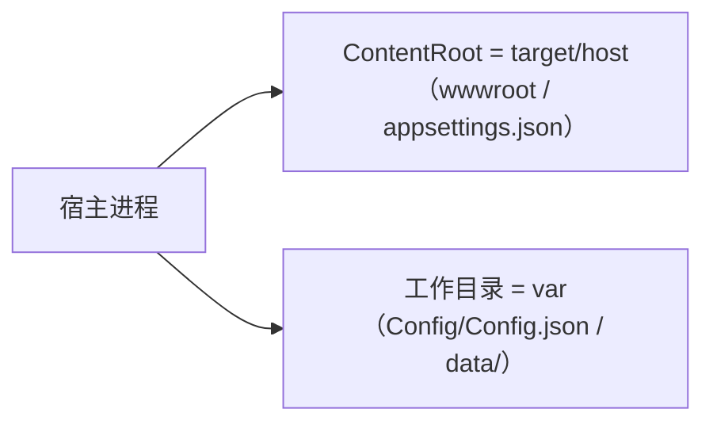
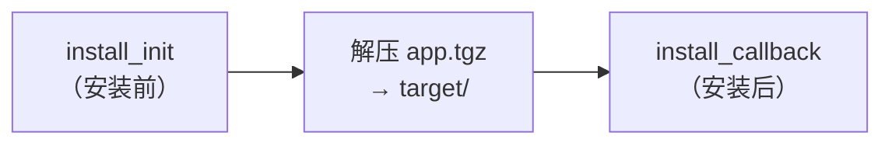
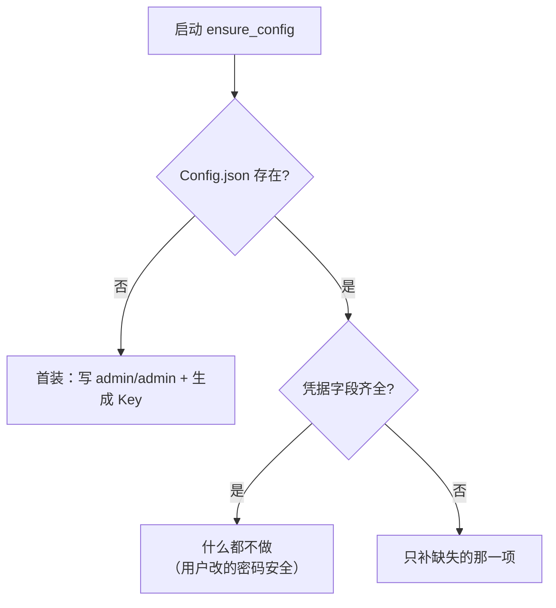

# 设计原理与关键决策

本文记录「把 Docker 项目改成飞牛原生应用」时踩到的坑和对应决策，
每一条都基于**在本机（飞牛 fnOS 1.2.0302 / arm64 / Debian 12）的实测**，
不是推测。

## 整体思路

上游 Router2API 是一个标准的 ASP.NET Core 程序，理论上可以直接跑。
但它假设运行环境是 Docker 镜像（有 dotnet 运行时、有独立的 redis 容器、
容器内目录是一次性的）。飞牛环境有三个前提不成立：



## 决策一：自包含发布，而不是声明依赖

飞牛应用中心的依赖包机制是 `manifest` 里写 `install_dep_apps=nodejs_v24` 这种，
但**应用中心没有 .NET 的依赖包**（实测本机 `/var/apps/` 下只有 nodejs_v24）。
可选方案只有两个：

| 方案 | 问题 |
|------|------|
| 让用户在 NAS 上自己装 .NET | 用户操作成本高，且飞牛的只读系统分区不方便长期维护 |
| **自包含发布（选这个）** | 包体大（约 100MB），但装上就能跑，零外部依赖 |

```bash
dotnet publish -r linux-arm64 --self-contained true
```

产物自带完整 .NET 运行时和 `Router.Host` 可执行文件（apphost）。

> 注意：自包含发布必须**按架构分开**，arm64 和 x64 的包不能混用。
> 所以 CI 用 matrix 跑两个原生 runner 各出一个包。

## 决策二：Redis 随包携带

这是最麻烦的一环，因为 Redis 在上游**不是可选项**。

### 为什么不能省

`src/Router.Infrastructure/Services/PluginProxyRuntime.cs`：

```csharp
// Any Redis error escapes here: node state has no memory fallback.
var state = await proxyPolicy.GetAsync(pluginKey, proxy, cancellationToken);
```

注释写得很直白：**Redis 出错就抛异常，没有内存回退**。它承载：

- 代理池的节点冷却状态（避免反复打到坏节点）
- 插件定时任务的分布式锁
- 插件的共享短期状态
- 模型元数据缓存

Redis 缺失时，管理后台能打开，但代理相关功能一用就报错。

### 踩坑过程

我实测了从 Debian 提取二进制的完整路径，连踩两个坑：

**坑 1：`redis-server` 包里的二进制是个软链。**

```
redis-server_7.0.15-..._arm64.deb
└── /usr/bin/redis-server -> redis-check-rdb   # 只是个软链，目标还不存在
```

真正的实体二进制在 **`redis-tools`** 包里。而 `redis-server` 本身是个
**多调用二进制（multi-call binary）**：同一份代码根据 `argv[0]` 决定自己扮演
`redis-server` / `redis-check-rdb` / `redis-check-aof` 中的哪个角色。

所以做法是：`cp redis-tools/usr/bin/redis-check-rdb app/redis/redis-server`。

**坑 2：缺 `liblzf.so.1`。**

直接运行报：

```
error while loading shared libraries: liblzf.so.1: cannot open shared object file
```

飞牛系统自带 `libjemalloc`、`libssl3`、`libsystemd` 等，但**不带 `liblzf`**
（Redis 用来压缩 RDB 的小库）。所以还要从 Debian 提取 `liblzf1` 包，
启动脚本设置 `LD_LIBRARY_PATH` 指向包内目录。

**验证通过**：

```bash
$ LD_LIBRARY_PATH=app/redis/lib app/redis/redis-server --version
Redis server v=7.0.15 sha=00000000:0 malloc=jemalloc-5.3.0 bits=64

$ app/redis/redis-cli -p 16401 PING
PONG
```

### 安全设计

Redis 只服务本应用，所以：

- `--bind 127.0.0.1` —— 只监听回环，局域网访问不到
- `--protected-mode yes` —— 双保险
- 不需要密码（回环 + 单机单应用，加密码反而要管理额外密钥）
- 端口取 `主端口 + 10000`，规律可预测、几乎不会和别的东西撞车
- `--maxmemory 128mb --maxmemory-policy allkeys-lru` —— 限制内存，避免吃了 NAS 的内存
- 不开 RDB / AOF 持久化 —— 数据都是带 TTL 的短期状态，重启丢了没影响

## 决策三：数据放 var，不放 target

飞牛的目录约定：

| 目录 | 含义 | 升级时 |
|------|------|--------|
| `target/` | 应用程序本体 | **整包替换** |
| `var/` | 运行时数据 | 保留 |
| `etc/` | 配置 | 保留 |
| `home/`、`tmp/`、`meta/` | 其他 | 保留 |

而上游有两处**硬编码的相对/程序路径**：

```csharp
// Program.cs：按「当前工作目录」读配置
builder.Configuration.AddJsonFile(
    Path.Combine(Directory.GetCurrentDirectory(), "Config", "Config.json"), ...);

// PluginCatalog.cs：按「程序所在目录」找插件
private readonly string _pluginRoot = Path.Combine(AppContext.BaseDirectory, "plugins");
```

如果就按上游的默认走，`Config/` 和 `plugins/` 都会落在 `target/` 里，
**升级后管理员密码、API Key、数据库、已装插件全部丢失**。

解决：

1. **配置与数据库**：启动脚本把工作目录 `cd` 到 `var`，
   于是 `Config/Config.json` 和 `data/router2api.db` 都落在 var。
2. **插件目录**：把 `target/host/plugins` 做成指向 `var/plugins` 的软链。
   首次安装把包内预置内容搬过去，升级时软链保持不动。



## 决策四：端口模式，不用统一网关

飞牛提供「统一网关」模式（应用不占端口，通过 `/app/<名字>` 转发并复用 NAS 登录态），
听起来很美，但对本项目有几个额外成本：

| 问题 | 说明 |
|------|------|
| 网关**不剥离前缀** | 转发给应用时路径仍是 `/app/router2api/xxx`，应用得自己处理 |
| 前端是 history 路由 | 上游用 `createWebHistory()`，资源引用是绝对路径 `/assets/...`，需要改写 |
| 上游是**对外提供 API** 的服务 | 模型接口 `/v1` 本来就是给外部程序调的，网关的登录态保护反而添乱 |
| 需要额外桥接器 | 得自己写一个转发代理，把 `/app/xxx` 剥掉再转给宿主 |

而端口模式是上游的原生工作方式：前端 history + `/api`、`/v1` 绝对路径，
在根路径下天然正确，不需要改写、不需要桥接器。

所以选择**直接端口模式**：应用监听 `0.0.0.0:<端口>`，
桌面图标直接用 `http://<NAS>:<端口>/` 打开。

> 安全取舍：端口默认 `0.0.0.0`，局域网可访问。
> 上游对 `/v1` 用 Bearer API Key、对管理后台用 Cookie + CSRF，
> 自身鉴权是完整的；如果要暴露到公网，建议前面加反向代理 + HTTPS。

## 决策五：ContentRoot 必须显式指定（实测踩坑）

这是打包后**真实启动才暴露**的一个坑，很值得记录。

为了让 `Config/Config.json` 落在持久化的 var 目录，启动脚本把工作目录 `cd` 到了 var。
但 ASP.NET Core 的 `ContentRoot` **默认跟随当前工作目录**，于是：

| 出问题的东西 | 表现 |
|--------------|------|
| `wwwroot/`（管理后台前端） | 首页 404，页面完全打不开 |
| `appsettings.json` | 读不到，默认配置丢失 |

修法是在启动前显式指定：

```bash
export ASPNETCORE_CONTENTROOT="${HOST_DIR}"   # 程序目录：找 wwwroot、appsettings.json
cd "${WORK_DIR}"                              # var 目录：上游找 Config/、data/
```

这样两个需求各归其位：



> 教训：静态检查（文件都在、JSON 合法）完全看不出这个问题，
> 只有把服务真跑起来发一次 HTTP 请求才发现。所以"端到端跑一次"不能省。

## 决策六：Redis 固定用 7.0.15

Debian 池里混着不同发行版编译的包，**版本号高低不等于能用**，得看目标系统的底层库版本：

| Redis 版本 | 来源 | 需要最高的 GLIBC | 飞牛（2.36）能否运行 |
|------------|------|------------------|----------------------|
| 7.0.15 | bookworm（Debian 12） | GLIBC_2.34 | ✅ 可以 |
| 8.6.3 | trixie（Debian 13） | GLIBC_2.38 | ❌ 不行 |

（上表用 `objdump -T <二进制> | grep -oE 'GLIBC_[0-9.]+' | sort -uV` 实测得出。）

如果放任脚本"取最新版"，会挑到 8.6.3，装上直接报错：

```
/lib/aarch64-linux-gnu/libc.so.6: version `GLIBC_2.38' not found
```

所以脚本**直接钉死 7.0.15**，并在打包时真跑一次 `--version` 做校验。
不做"自动挑版本 + 逐个降级"那套逻辑——飞牛的 GLIBC 版本是确定的，
选一个已知可用的版本最简单可靠，代码也短。

> 唯一注意：Debian 偶尔会清理池子里的旧版本。真遇到 404，
> 改 `assemble.sh` 顶部的 `REDIS_VERSION` 一行即可（换一个 bookworm 的 7.0.x）。

## 决策七：打包时关闭 TreatWarningsAsErrors

上游 `Directory.Build.props` 里有：

```xml
<TreatWarningsAsErrors>true</TreatWarningsAsErrors>
<AnalysisLevel>latest-recommended</AnalysisLevel>
```

这是上游约束自己代码质量用的。但作为**下游打包方**，如果上游某次提交引入了
一条新的分析器警告，我们的自动打包就会整体失败，而代码本身其实是能跑的。

所以 assemble.sh 里显式传 `-p:TreatWarningsAsErrors=false`：
代码质量由上游自己的 CI 把关，我们只关心能否产出可运行的程序。

## 决策八：清理软链

飞牛安装器会对 `app.tgz` 递归执行 `ApplyPermission`，
实测碰到软链（尤其断链）会直接报错：

```
ErrCodeInstallDirAuthException(10234) 设置目录权限失败
```

自包含发布本身可能带出 `.so` 相关软链，所以 assemble.sh 最后统一处理：
有效软链实体化成真实文件，断链直接删除，然后统一 `755`/`644` 权限。

## 决策九：端口改了要同步 ui/config

飞牛读 `target/ui/config` 里的 `port` 生成桌面入口地址。
但那个文件是**打包时固化**的，用户在安装向导里改了端口后，点图标仍会打开旧端口。

所以 `cmd/main start` 时会把 `ui/config` 的 `port` 字段改写成实际端口
（用 sed 只替换 port 的值，保留其他内容；改完用 python 校验过 JSON 仍有效）。

## 决策十：install_init 不能检查包内文件（真实装不上，踩坑）

这是唯一一次**装机现场翻车**的坑，代价是用户拿到包后根本装不上。

一开始我把"包体完整性检查"写在了 `install_init` 里：

```bash
# ❌ 错误做法
[ -f "${APPDEST}/host/Router.Host.dll" ] || fail "安装包不完整：缺少主程序"
```

现象：飞牛应用中心上传 fpk 后，直接报

```
✗ 安装包不完整：缺少主程序，请重新下载 fpk。
```

`/var/apps/` 下什么都不剩，安装被整个中止。

**根因**：`install_init` 是安装**前**执行的脚本。这时的时序是：



第 1 步时 `target/` 还是空的，`host/Router.Host.dll` 当然不存在——
于是检查必然失败，安装流程被自己拦死。

**验证方法**：翻 `/var/log/apps/Router2API.log`，内容正是我那句报错，
一句话就定位了。

**修法**：

| 脚本 | 时机 | 该做什么 |
|------|------|----------|
| `install_init` | 安装前，target 为空 | 只能做**跟文件无关**的检查，例如端口占用预检 |
| `install_callback` | 安装后，文件已就位 | 才可以检查包体、建目录、修权限 |

而且即便在 `install_callback` 里，包体检查也**只告警不中止**：
不同飞牛版本的解压时序可能有差异，宁可在启动阶段给出明确错误
（`cmd/main start` 里有同样的检查），也不要冒"装不上"的风险。

> 教训：写生命周期脚本前，先想清楚每个脚本的**执行时机**，
> 以及那个时刻**文件系统上到底有什么**。
> 参考已装应用的做法也很有用——`linkjet`/`system-assistant`/`dsh` 的
> `install_init` 全都只有 `exit 0` 或只碰 `TRIM_PKGVAR`，没有一个是检查 target 的。

## 首次安装的凭据处理

上游明确**不提供默认密码**，首次启动必须给出可用的管理员密码，否则连后台都进不去。

处理逻辑（`ensure_config`）：

| 场景 | 行为 |
|------|------|
| 配置不存在（首次安装） | 写 **admin / admin** + 自动生成 API Key |
| 配置已存在、凭据齐全 | **完全不碰**（关键，见下） |
| 配置存在但缺某个凭据 | 只补缺的那一项 |
| API Key | 没填就按上游格式生成 `sk-router-<48位十六进制>` |

**为什么默认给 admin/admin：** 装完就能直接登录，不用去应用数据目录翻密码文件。

### 一条硬规则：配置已有凭据时永不重写（实测踩坑）

一开始我按"向导传了值就更新配置"来实现，结果**用户改的密码每次重启都被冲回 admin**。

原因：飞牛会把安装向导填的值作为环境变量，**在每次启动都传进来**：

```
TRIM_APP_START 时 → wizard_admin_username=admin, wizard_admin_password=admin
```

所以"环境变量里有值"根本不能说明"用户想改配置"。
日志里的实证非常直白：**5 次启动、5 次 `Config.json written`、0 次 `kept`**。

我试过用"凭据指纹比对"来绕过，但也失败了——首次安装时向导值为空，
指纹记的是空值；之后每次启动传入 `admin/admin`，指纹必然"变化"，
于是又被判定成"用户改配置"。**指纹方案从根上就不可靠。**

最终采用最简单也最稳的规则：



判断"齐全"用 `config_has_key` 检查点分路径，密码会同时看
`Password`（明文）和 `PasswordHash`（哈希）两个字段——只要有一个就算有。

> 要主动改凭据，请走**应用设置**（`wizard/config` + `config_callback`），
> 那里密码留空就是"不改"，语义明确，不靠猜。

配置用 python 写 JSON（正确处理密码里的引号、反斜杠），
没有 python 时退回转义后手写 JSON。

> 配置落盘到 `Config/Config.json` 而不是只给环境变量，是因为上游的
> 优先级是 `Config.json > User Secrets > 环境变量`。
> 如果只用环境变量，用户在管理后台改了密码，重启后会被旧的环境变量覆盖。

## 插件目录权限（放插件就起不来，真实踩坑）

用户在插件目录里放了插件后，应用**启动即崩**：

```
Unhandled exception. System.UnauthorizedAccessException:
Access to the path '/vol2/@appcenter/Router2API/host/plugins/workbuddy' is denied.
```

### 根因：属主不是应用用户

用 `stat` 一看就清楚：

```
workbuddy  mode=711 owner=dinding:root
opencode   mode=711 owner=dinding:root
```

`711` 的含义是「属主 rwx，其他人只有 `--x`」——**能进入目录，但不能读内容**。
而宿主以专用用户 `Router2API` 运行，对 `dinding` 的目录来说它属于"其他人"，
只能 `--x`，于是 `Directory.EnumerateFiles` 抛异常。

**为什么上游会直接崩**：`PluginCatalog.LoadDirectoryAsync` 调
`DotNetPackageLoader.FindMainAssembly` 时没做异常保护，
未捕获的 `UnauthorizedAccessException` 直接终止进程。

**为什么权限是这样的**：用户通过飞牛文件管理 / SMB 拷进去的目录，
属主自然是自己的账号，权限也由文件管理器的默认策略决定（711）。

### 处理：启动前隔离读不了的插件

`cmd/main` 在启动宿主前调用 `quarantine_unreadable_plugins`：

1. **先尝试自救**：如果目录属主就是应用用户，补上 `u+rwX` 权限即可恢复
2. **救不回来就隔离**：移动到 `plugins/.skipped/`（点开头目录上游会自动忽略），
   保证宿主能正常启动，而不是整个崩掉
3. **给出可操作的提示**：通过 `TRIM_TEMP_LOGFILE` 告诉用户改属主和权限
4. **自动恢复**：下次启动时，`.skipped/` 里已修好权限的插件会自动移回原位

> 实测确认：`mv` 一个目录只要求**父目录可写**，与目标目录自身权限无关，
> 所以隔离操作在 `000/111/555/711` 各种权限下都成立。

### 给用户的正确做法

放插件后，把插件目录的属主改成应用用户、权限设为 755：

```bash
chown -R Router2API:Router2API /vol2/@appdata/Router2API/plugins/你的插件
chmod -R 755 /vol2/@appdata/Router2API/plugins/你的插件
```

然后重启应用（或直接重启，会自动把 `.skipped` 里的插件放回来）。

这条说明也写进了**应用设置向导**（`wizard/config`）的提示里，
用户点开设置就能看到，不用去翻文档。

## 实测记录

以下全部在**本机真实环境**（飞牛 fnOS 1.2.0302 / aarch64 / Debian 12 bookworm）
跑通，不是推测。本机装了 .NET 10 SDK 与 Node 24 后，把整条流水线走了一遍。

### 构建链路

| 验证项 | 结果 |
|--------|------|
| 前端 `pnpm install --frozen-lockfile` | ✅ 用上游声明的 pnpm 12.3.4 |
| 前端 `pnpm build` | ✅ 4685 模块，产物同步到 `src/Router.Host/wwwroot` |
| `dotnet publish --self-contained -r linux-arm64` | ✅ 产出 170MB，`Router.Host` 是 ARM aarch64 ELF |
| wwwroot 是否被 publish 带上 | ✅ `index.html` + assets + `.gz`/`.br` 都在 |
| `scripts/assemble.sh` 全流程 | ✅ 6 步全通，产出 173MB 应用内容 |
| `fnpack build` | ✅ 产出 68MB 的 `Router2API.fpk` |

### 运行与功能

从**真实 fpk 解包**后（模拟飞牛安装）验证：

| 验证项 | 结果 |
|--------|------|
| `cmd/main start` | ✅ 退出码 0，Redis + 宿主都起来 |
| `cmd/main status` | ✅ 运行中返回 0；停止后返回 3 |
| `cmd/main stop` | ✅ 端口释放、无残留进程 |
| 管理后台首页 | ✅ HTTP 200，`<title>Router2API 控制台</title>` |
| 前端 JS 资源 | ✅ HTTP 200，1.6MB |
| 管理员登录（含中文+特殊字符密码） | ✅ HTTP 200 |
| `/v1/models`（Bearer API Key） | ✅ HTTP 200 |
| Redis 是否只监听回环 | ✅ `127.0.0.1:端口+10000` |
| 宿主监听地址 | ✅ `0.0.0.0:端口` |

### 数据持久化（本项目最核心的价值）

模拟“覆盖升级”（整包替换 target 目录）后验证：

| 验证项 | 结果 |
|--------|------|
| 管理员密码 | ✅ 保留，且旧密码仍能登录 |
| 用户已装插件 | ✅ 保留（放在 var/plugins） |
| 插件目录软链 | ✅ 升级后自动重建 |
| SQLite 数据库 | ✅ 保留 |
| `ui/config` 端口 | ✅ 自动同步成实际端口（新包默认 5242 → 15243） |
| Config 里的自定义字段 | ✅ 合并更新时保留 |

### 边界与容错

| 验证项 | 结果 |
|--------|------|
| 密码中的引号/反斜杠 | ✅ 正确写入 JSON 且能登录 |
| 首装不填密码 | ✅ 固定 admin/admin，可直接登录 |
| 后台改过密码（变成哈希）后重启 | ✅ 哈希保留，不会被明文覆盖 |
| 向导改端口 | ✅ 派生字段（Redis 地址、数据库路径）自动跟着变 |
| 换个存储空间（PKGVAR 变） | ✅ 数据库路径自动更新 |
| 端口被别的程序占用 | ✅ 明确报错并退出，不会假报“启动成功” |
| 兼容性校验 | ✅ 挑到 GLIBC 不兼容的 Redis 会自动换版本 |

### 打包规范

| 验证项 | 结果 |
|--------|------|
| fnpack 必需文件 | ✅ `cmd/` 下 9 个脚本缺一不可，缺则报错 |
| fnpack 产物命名 | ✅ 固定输出 `Router2API.fpk`，不含版本号，需自行改名 |
| `app.tgz` 内容构成 | ✅ = `app/` 内容 + `config/` |
| fpk 内权限位 | ✅ 普通文件 644、可执行 755（脚本显式设置，不受 umask 影响） |
| 包内软链 | ✅ 全部实体化，无残留（避免安装器报权限失败） |
| `ui/config` 读取位置 | ✅ 从 `target/ui/config` 读（对比已装的 dsh / system-assistant） |
| 飞牛有无 dotnet / redis 依赖包 | ✅ 都无（`/var/apps/` 下只有 nodejs_v24） |
| 双架构 | ✅ amd64 侧的 `redis-tools`/`liblzf1` 包同样存在，CI matrix 可构建 |

### 未在本机验证的部分

- **amd64 包的实际运行**：本机是 arm64，x86 侧由 CI 构建，逻辑与 arm64 一致。

### 装机现场验证（真实飞牛应用中心）

由用户在飞牛应用中心实际上传 fpk 验证：

| 验证项 | 结果 |
|--------|------|
| v2.0.0 首次安装 | ❌ 报「缺少主程序」——`install_init` 时机用错（见决策十） |
| 修复后的安装流程（本地时序模拟） | ✅ install_init / install_callback 都通过 |

> 这个坑说明：**本地把服务跑起来 ≠ 能装得上**。
> 安装器有自己的脚本时序，只有真的走一遍应用中心安装才能发现。
> 后续改动生命周期脚本后，建议实际装一次再发版。

> 本机环境限制记录（供后来者参考）：
> - `/tmp` 是 1.8G 的 tmpfs，装 .NET SDK（232MB）会空间不足，
>   需要给 `dotnet-install.sh` 设 `TMPDIR` 到数据盘。
> - 本机 umask 是 `0000` 且目录带 ACL，新建文件默认 `000`，
>   需要显式 `chmod` 才能执行。这也是脚本里坚持显式设权限的原因之一。
> - `pkill -f <模式>` 在该环境下会匹配到执行它的 shell 自身
>   （模式出现在自己的命令行里），导致脚本自杀；改用按 `/proc/<pid>/exe`
>   精确匹配的方式规避。
