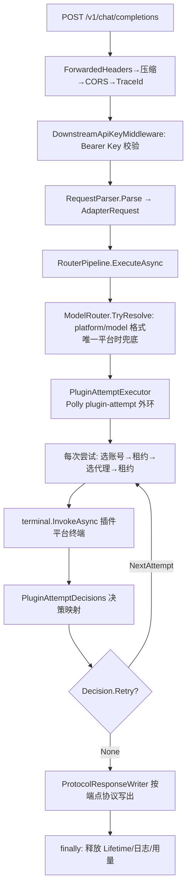

# Router2API 插件开发参考手册

> 基于 2025-09 上游 main（宿主 v2.0.3，commit c942cb7）全量源码研究整理。
> 覆盖：宿主架构、两种插件运行时、JS/C# 契约、官方插件实例、发行打包。
> 所有数字均经源码二次核对；与上游文档冲突处已在文中标注。

---

## 目录

1. [仓库全景](#1-仓库全景)
2. [宿主架构与请求链路](#2-宿主架构与请求链路)
3. [两种插件运行时](#3-两种插件运行时)
4. [JS 插件开发](#4-js-插件开发)
5. [C# 插件开发](#5-c-插件开发)
6. [官方插件实例剖析](#6-官方插件实例剖析)
7. [宿主测试揭示的行为契约](#7-宿主测试揭示的行为契约)
8. [发行与打包](#8-发行与打包)
9. [加载失败避坑清单](#9-加载失败避坑清单)
10. [红线清单](#10-红线清单)
11. [文档与代码的不一致点](#11-文档与代码的不一致点)

---

## 1. 仓库全景

| 仓库 | 职责 |
|---|---|
| `NNNNolan/Router2API` | 宿主本体：Contracts（契约）、Infrastructure（基础设施）、Host（宿主）、Vue 管理前端、宿主测试 |
| `NNNNolan/Rouer-Plugins-js` | js-forwardapi 插件 + JS SDK（DEVELOPMENT.md/API.md/index.d.ts/CAPABILITIES.md）+ esbuild 工具链 |
| `NNNNolan/Rouer-Plugins-Csharp` | ForwardAPI 插件（C#）+ C# SDK 教程 |

仓库间**无 git submodule**；宿主不依赖插件仓库源码即可构建。

**代码规模**（main，2025-09）：C# 17,648 行 / 90 文件；Vue 前端 2,495 行；sdk 文档 581 行/4 篇；测试 3,976 行。

**版本基线**：宿主 .NET 10，JS 运行时 Jint 4.16.4；**C# Contracts 2.0 与 JS Host API 1 是两套独立版本编号**。

### 1.1 关键目录

```
src/
  Router.Contracts/          ← 插件的全部公开契约（11 个文件，C# 插件引用此包）
    Plugins/PluginContracts.cs      插件声明特性 + IPluginModule/IPluginBuilder (407行)
    Host/HostContracts.cs           宿主能力接口全家 (787行)
    Host/PluginServices.cs          IPluginServices 注入面 (170行)
    Domain/Models.cs                AdapterRequest/Response、Account、Credential、Proxy (537行)
    Domain/PluginAttemptDecision.cs 决策结构（冷却/禁用/重试）
    Pipeline/PipelineContracts.cs   IPlatformTerminal（插件唯一必选接口）
  Router.Host/Plugins/       ← 宿主加载与运行插件的实现（internal，插件不得依赖）
    PluginCatalog.cs (38KB)         发现/加载/staging/切换/drain/回滚
    JintPackageLoader.cs            JS 插件加载
    DotNetPackageLoader.cs          C# 插件加载
    PluginAssemblyLoadContext.cs    C# 插件隔离
    PluginReleaseService.cs         GitHub 仓库订阅/下载/校验/安装
    JavaScript/ (10 文件)            JS 能力实现（ctx 桥）
  Router.Host/Api/ApiEndpoints.cs    全部 REST 路由 (1252行)
  Router.Host/Security/              双轨鉴权
  Router.Host/Pipeline/              路由流水线
  Router.Infrastructure/             持久化/代理/账号/租约/策略
web/src/                     ← Vue 3 管理后台（13 个页面）
sdk/                         ← 4 篇 SDK 文档（README/AI-DEVELOPMENT/HOST-LIFECYCLE/PLUGIN-RELEASES）
tests/Router.Tests/          ← 宿主测试（含 js-proxy-demo 插件夹具）
```

---

## 2. 宿主架构与请求链路

### 2.1 启动流程（Program.cs，121 行）

1. **配置加载顺序**：`appsettings.json` → `ROUTER2API_` 环境变量 → User Secrets → `Config/Config.json`（热重载，优先级最高，管理后台配置页直接改它）
2. **DI 注册**：安全三件套（PasswordHasher/AdminAuthService/ApiKeyService）→ 基础设施（AddRouterInfrastructure）→ 插件（PluginCatalog/PluginReleaseService/PluginTaskRunner）→ 4 个 HostedService（插件 Cron、日志清理、模型元数据预热、代理订阅刷新）
3. **启动初始化**：`ConfigFileService.EnsureCreated()` → `MigratePlaintextPasswords()`（明文→PBKDF2，仅内存）→ `DatabaseInitializer.Initialize()`（SqlSugar CodeFirst）→ `PluginCatalog.ReloadAsync(null)`（加载全部插件）
4. **中间件顺序**：ForwardedHeaders（信任所有代理）→ ResponseCompression → ContentType 去重 → CORS("v1")（AllowAnyOrigin，不带 Credentials）→ TraceId → DownstreamApiKey（只拦 /v1）→ AdminSession（只拦 /api/admin）
5. **静态文件**：wwwroot 有 index.html 则启用默认文件+预压缩（.br/.gz）+ 静态文件；SPA fallback 回发 index.html

### 2.2 一次 /v1/chat/completions 的完整链路



关键文件对照：

| 步骤 | 文件 | 要点 |
|---|---|---|
| 鉴权 | Security/AuthMiddleware.cs:87-138 | Bearer 或 x-api-key；固定时间比较；管理员会话可免 Key 读 GET /v1/models |
| 解析 | Api/RequestParser.cs | body 可带 `endpoint` 字段强制切端点；白名单捕获请求头 |
| 选平台 | Pipeline/RouterPipeline.cs:117-128 | `model` 必须是 `平台/模型名`；唯一启用平台时兜底 |
| 推理钳制 | Services/PluginProxyRuntime.cs:164 | 按模型元数据 reasoningLevels 钳制 reasoning_effort |
| 尝试外环 | PluginProxyRuntime.cs:29-162 + PluginResiliencePipelines.cs | Polly `plugin-attempt`：MaxRetryAttempts=34（实际被 Clamp 到 MaxAttempts-1）；**流绝不重放** |
| 选账号 | PluginProxyRuntime.cs:407-492 | 过滤：平台匹配/非禁用/自定义 selector/Redis 冷却；排序：PreferredExpiry→Weight→随机 |
| 租约 | Services/ResourceLeaseManager.cs | 进程内 InFlight 计数 + 500ms 自旋等锁 |
| 选代理 | PluginProxyRuntime.cs:373-405 | 惰性：首次真正发请求才取；优先 30 分钟内探活 Healthy 的节点 |
| 决策映射 | Services/PluginAttemptDecisions.cs | **唯一**解释 reason/predicate 的地方；三条铁律：脚本不能伪造传输失败、无代理故障就清空 ProxyAction、有流就禁止 Retry |
| 决策落地 | PluginProxyRuntime.cs:553 | Disable→DisableAsync；Cooldown→SetCooldownAsync；代理→proxyPolicy.ReportAsync |
| 写出 | Api/ProtocolResponseWriter.cs (1186行) + OpenAiResponseWriter.cs | 插件只产出内部 AdapterResponse（Completion/Stream/Raw 三态），出口按端点还原协议 |
| 观测 | RouterPipeline.cs:79-114 | RequestLog（含尝试明细）→ UsageBucketStore → PluginLog |

**双层重试**（PluginResiliencePipelines.cs）：
- 业务层 `plugin-attempt`：重试会重新选账号选代理，每次新账号新节点（上限 = 插件策略 MaxAttempts）
- 传输层 `task-safe-read` / `explicit-replay`：只救"请求还在发送阶段"的传输异常，MaxRetryAttempts=5；**不按状态码重试、不重放 POST、不动 SSE**

**流的所有权**：一旦拿到流，租约/client/timeout 全部移交 `PluginResponseLifetime`，流结束才回收。

### 2.3 双轨鉴权

| 维度 | 管理后台 /api/admin | 模型面 /v1 |
|---|---|---|
| 凭据 | 用户名+密码（PBKDF2-SHA256，10 万次迭代） | 全局单一 API Key（`sk-router-{48hex}`） |
| 会话 | **内存态** sessionId，重启即失效 | 无会话，每请求带 Key |
| 传输 | Cookie `router_admin_session`(HttpOnly 12h) + `router_admin_csrf` | `Authorization: Bearer` 或 `x-api-key` |
| CSRF | 三层：Origin==Host 校验、豁免名单、X-CSRF-Token 恒定时间比对 | 不需要（CORS 不带 Credentials） |
| 防爆破 | 每用户名 1 分钟 5 次失败即锁 | 恒定时间比较 |

交汇点：管理员会话可免 Key 读 `GET /v1/models`（测试台用）。

### 2.4 数据库（SQLite，9 张表）

`accounts`（账号）、`proxy_subscriptions`（订阅源）、`proxy_endpoints`（节点）、`request_logs`（请求日志）、`usage_buckets`（用量聚合）、`resource_events`（资源事件）、`task_logs`（任务日志）、`plugin_logs`（插件日志）、`plugin_http_origins`（HTTP 出口记录）。

### 2.5 REST 接口清单

**管理面 /api/admin**（除 login/health/version 外全需 Cookie+CSRF）：

| 组 | 端点 |
|---|---|
| 认证 | POST login / logout / GET me / POST password / GET health / version |
| API Key | GET api-key(掩码) / GET api-key/raw(明文) / POST api-key/rotate |
| 配置 | GET config / PUT config |
| 观测 | GET metrics / metrics/stream(SSE) / analytics(overview) / logs |
| 模型 | GET model-plaza / POST model-plaza/refresh / model-metadata/refresh / GET platforms / platforms/{p}/models / platforms/{p}/state |
| 账号 | GET accounts / GET+POST platforms/{p}/accounts / DELETE accounts/{id} |
| 代理 | proxies / proxies/{id}/probe / proxy-subscriptions / proxy-subscriptions/{id}/refresh |
| 插件 | GET plugins / POST plugins/reload / plugins/{key}/reload / plugins/{key}/state / plugins/{key}/manifest / plugins/{key}/page / plugins/{key}/tasks/{task}/run / DELETE plugins/{key} / task-logs / plugin-logs |
| 插件发布 | GET+POST plugin-repositories / plugin-repositories/{owner}/{repo}/releases[/{tag}] / POST plugin-repositories/install / GET plugin-updates / plugin-installations |
| 测试台 | POST test/chat / test/models / test/credentials/{id} / test/proxy/{id} / test/compare / GET test/sessions |

**插件端点**：`ANY /api/plugins/{pluginKey}/{**route}`（AdminSession+CSRF，body ≤1MiB，并发闸门 503）

**模型面 /v1**（需 Bearer Key，CORS v1 开放）：

| 端点 | 协议 |
|---|---|
| POST /v1/chat/completions | OpenAI Chat |
| POST /v1/completions | OpenAI Legacy |
| POST /v1/responses | OpenAI Responses |
| POST /v1/messages | Anthropic Messages |
| POST /v1/embeddings | OpenAI Embeddings |
| GET /v1/models | OpenAI Models（管理员会话可免 Key） |

---

## 3. 两种插件运行时

| 维度 | C# DLL 插件 | JS 插件（Jint） |
|---|---|---|
| 定位 | 完整 CLR 终端，可回收 AssemblyLoadContext；性能/能力上限高 | 宿主托管解释执行，能力由清单声明的 ctx 桥接授予 |
| 包内容 | `plugins/<key>/Plugins.Xxx.dll` + 依赖 + deps.json | `plugin.json` + entry ESM bundle + 可选自包含 HTML |
| 身份 | `[PlatformAdapter].PluginKey` 必须等于目录名 | manifest `id` 必须等于目录名 |
| 生命周期 | IPluginModule：Configure→StartAsync→StopAsync；**进入 StartAsync 后只调 StopAsync 不再 Dispose** | hooks：invoke★/getModels/validateCredential/start/stop/selectAccounts/refreshCredential/getMainPage |
| 声明方式 | 特性（PlatformAdapter/CredentialSchema/ModelCache/ModelAlias/Fallback/PluginEndpoint/ScheduledTask） | plugin.json 的 hooks/permissions/policy/endpoints/tasks/jobs |
| 引擎隔离 | 每插件一个 AssemblyLoadContext | **每次调用一个独立 Jint Engine**（模块级变量跨调用不共享） |

**选型**：新写轻量提供方/协议适配 → JS（esbuild 打 TS）；维护既有 C# 提供方 → C#。官方两个仓库的 ForwardAPI 是"同一插件两种运行时"的活对照。

---

## 4. JS 插件开发

### 4.1 最小可用模板（来自仓库夹具 js-proxy-demo）

**plugin.json**（宿主用 `UnmappedMemberHandling.Disallow` 反序列化——**未知字段直接拒绝**；≤64KB）：

```json
{
  "schemaVersion": 1,
  "id": "js-proxy-demo",
  "name": "JS 代理池示例",
  "version": "1.0.0",
  "runtime": "jint",
  "hostApi": "1",
  "entry": "server/plugin.mjs",
  "format": "esm-bundle",
  "platform": {
    "name": "js-proxy-demo",
    "displayName": "JS 代理池示例",
    "credentialKinds": ["ApiKey"]
  },
  "hooks": { "invoke": "invoke", "getModels": "getModels", "start": "start" },
  "permissions": {
    "http": { "origins": ["https://example.com"], "routes": ["pool"] },
    "state": ["read", "write"],
    "jobs": ["start", "read", "cancel"],
    "createAnonymousAccount": true
  },
  "policy": { "maxAttempts": 1 },
  "endpoints": [
    { "method": "GET",  "path": "status", "auth": "AdminSession", "handler": "status" },
    { "method": "POST", "path": "probe",  "auth": "AdminSession", "handler": "probe" }
  ],
  "tasks": [
    { "name": "js-proxy-demo-check", "handler": "checkPool",
      "cron": "0 0 3 * * *", "timeoutSeconds": 30, "description": "…" }
  ],
  "jobs": [
    { "name": "js-proxy-demo-probe", "handler": "checkPool", "timeoutSeconds": 30 }
  ],
  "page": { "title": "JS 代理池示例", "entry": "ui/index.html" }
}
```

**server/plugin.mjs**（五个导出覆盖五类宿主接触面）：

```js
// ① 生命周期：加载时创建匿名账号（需 createAnonymousAccount 权限）
export async function start(ctx) { await ctx.accounts.ensureAnonymous(); }

// ② 模型发现：返回平台内模型 ID（宿主发布时自动加 <id>/ 前缀，插件不要自己拼）
export function getModels() {
  return [{ id: "echo", displayName: "Jint Echo", supportsStreaming: true }];
}

// ③ 模型入口：一次生成
export function invoke(ctx) {
  const message = ctx.request.messages.at(-1)?.content || "";
  return ctx.reply.completion({ model: ctx.request.model, content: `Jint: ${message}`,
                                finishReason: "stop" });
}

// ④ 任务/job 共用 handler：走代理池访问上游，状态存 shared
export async function checkPool(ctx) {
  if (ctx.job) await ctx.jobs.progress({ stage: "requesting" });
  const r = await ctx.http.request({ method: "GET", url: "https://example.com",
    route: "pool", responseType: "text", timeoutMs: 8000,
    retry: { maxRetries: 1, delayMs: 200 } });
  // HTTP 工厂不解释状态码，业务解释属于插件
  const snapshot = { statusCode: r.statusCode, checkedAt: new Date().toISOString(),
                     ok: r.statusCode >= 200 && r.statusCode < 300 };
  await ctx.state.set("last-probe", snapshot, { ttlSeconds: 86400 });
  return snapshot;
}

// ⑤ 管理端点 handler
export async function status(ctx) {
  if (ctx.query?.jobId) return ctx.json(200, await ctx.jobs.get(ctx.query.jobId));
  return ctx.json(200, { lastProbe: await ctx.state.get("last-probe") });
}
export async function probe(ctx) {
  return ctx.json(202, await ctx.jobs.start("js-proxy-demo-probe", null, { key: "manual-probe" }));
}
```

**ui/index.html**：自包含 HTML（≤1MB，加载期缓存），运行在 sandbox iframe，唯一桥梁是宿主注入的 `window.Router2API.request(method, route, body)`（父页负责前缀/Cookie/CSRF）。

### 4.2 manifest 完整字段清单

权威定义：`JsPluginManifest.cs`（未知字段直接拒绝）。★=必填。

**包级**：`schemaVersion`★=1、`id`★（`^[a-z0-9][a-z0-9._-]{0,63}$` 且=目录名）、`name`★、`version`★、`description`、`runtime`★="jint"、`hostApi`★="1"或"1-preview"、`entry`★（≤2MB ESM）、`format`★="esm-bundle"、`platform`/`platforms`（1–16 个）、`hooks`、`permissions`、`policy`、`endpoints`、`tasks`、`jobs`、`page`、`streamMappers`。

**平台对象**：`name`★（小写标识符）、`displayName`、`credentialKinds`（默认 `["ApiKey"]`）、`modelCacheTtlSeconds`（默认 300，0–86400）、`probeEndpoint`、`hooks`/`policy`（平台级覆写）。

**permissions 合法值**：

| 域 | 合法值 |
|---|---|
| http.routes | `pool` \| `direct` \| `attempt` |
| http.origins | 精确 http(s) origin（禁通配符/凭据/路径/query/fragment） |
| accounts | `read` `readCredentials` `write` `refresh` `setCooldown` `disable` |
| state / sharedState | `read` `write` |
| jobs | `start` `read` `cancel` |
| models | `read` `invalidate` `refresh` |
| tasks | `run` `writeLog` |
| crypto | `random` `hash` `hmac` `encoding` `decimal` |
| 其他 | `createAnonymousAccount`、`readCurrentCredential`、`http.manageOrigins` |

**policy**：`maxAttempts`（默认 1，1–35）、`attemptTimeoutSeconds`（默认 60，1–60）、`totalTimeoutSeconds`（默认 180，1–180）、`transportFailure{retry,cooldownProxy,accountCooldownSeconds(0–86400)}`。

**endpoints[]**：`method`（GET/POST/PUT/PATCH/DELETE/HEAD，禁 OPTIONS）、`path`（≤200，禁 `..`/`\`/`?`/`#`/`://` 与 `api/admin` 前缀）、`auth`（六种，默认 AdminSession）、`handler`、`platform`；`(method,path)` 去重。

**tasks[]**：`name/handler/cron/timeoutSeconds(1–3600)/description/platform`；cron 五/六字段或 `@hourly`，**中国标准时间**，秒位 0–59。
**jobs[]**：`name/handler/platform/timeoutSeconds(1–3600)/description`。
**page**：`title/entry`（HTML ≤1MB）。**streamMappers**：`名→{event,end,completion?}`，≤32 个。

### 4.3 hooks：职责、超时、输入输出

每个 hook 收 `(ctx, input)`；**授权永远用宿主原生闭包绑定的身份，改 ctx.pluginKey/phase 无效**。

| hook | 超时 | 职责/返回 |
|---|---|---|
| `invoke`★ | setup 60s / 总 180s | 一次生成；返回 `reply.completion/error/raw/mappedStream` 四态之一 |
| `getModels` | 25s | 模型数组 ≤2000 条、id ≤256 字符 |
| `validateCredential` | 10s | `{success, error?}` |
| `selectAccounts` | 5s | 整批候选只读快照；返回 `[{accountId, eligible, weight, preferredExpiry}]`；**禁止 HTTP/写状态/启动 job** |
| `refreshCredential` | 55s | 刷新凭证；禁递归 accounts.refresh；结果进数据库 CAS |
| `start` | 10s | 预热/匿名账号；**此刻新平台尚未对外注册**；不要做不可回滚的操作 |
| `stop` | 5s | 清理；不应启动新长期工作 |
| `getMainPage` | 5s | HTML（宿主缓存） |
| 端点 handler | 25s | `ctx.json(status, body)`，仅 JSON/204 |
| 任务/job handler | 各自 timeoutSeconds | 任务返回值不是 job 结果 |
| 同步 mapper / finalizer | 100ms / 250ms | **必须同步**，返回 `{state, chunks, done?}` |

### 4.4 ctx 宿主能力（完整 API 面）

**ctx 元数据**：`pluginKey / generationId / pluginVersion / platform / invocationId / traceId / query / body / task / job / phase / request{model,endpoint,stream,maxTokens,temperature,messages,tools,extensions,headers,originalBodyRef} / account`（凭据默认不投影）。

**ctx.http**：`request(spec)`（缓冲 ≤4MB）、`open(spec)`（流式 source 句柄）、`createClient({route,subscriptionIds,allowDirectFallback})→{handle,request,open,close}`、`readText/readJson/readBase64(handle)`、`drain(handle)`（≤32MB）、`snapshotError(handle)`（错误体快照，截 4000 字符）、`close(handle)`、`approvedOrigins/approveOrigin/revokeOrigin`（仅管理端点）。

`request/open` 的 spec：`{method, url, route("pool"|"direct"|"attempt"), client, headers, body/bodyText/bodyBase64/form(五选一), contentType, originalJson:{source,remove,set}, responseType, timeoutMs(1–60000,默认30000), readIdleTimeoutMs(100–600000), subscriptionIds, allowDirectFallback, followRedirects, retry:{maxRetries(0–5),delayMs,allowUnsafeMethods}}`。

三条路线语义：`attempt`（模型尝试原生 client，代理按需绑定）/ `pool`（独立代理池，fail-closed 不隐式直连）/ `direct`（显式直连）。重定向 ≤5 跳、跨 origin 仅 GET/HEAD 且只保留 Accept/Accept-Language/User-Agent；禁 Host/Connection/Content-Length/Transfer-Encoding/Proxy-Authorization/Upgrade。

**ctx.state**（及 `state.local` / `state.shared` 同形状）：`available/get/getString/set/setString/remove/expiry/putIfAbsent/increment/compareExchange`；写入必须带 TTL（默认 300s）。`local`=本版本内存（卸载即失，预算 256 项/64KiB/1 天），`shared`=Redis+插件命名空间（**无隐式内存回退**，4MiB/30 天）；increment 返回精确 Int64 字符串。

**ctx.accounts**：`ensureAnonymous()`（仅 start+权限）、`currentCredential()`（仅 attempt+权限）、`list({includeCredentials})/get/save/delete/readCredentials/compareExchangeCredential(id,expectedVersion,credential)/refresh(id)/setCooldown(id,until,reason,statusCode)(≤30天)/clearCooldown(id,expectedReason)/disable(id,reason,statusCode)`。**模型尝试应优先返回显式 attempt.decision，而非再调 setCooldown 重复动作**。

**ctx.models**：`list(platform)/metadata()/refresh(platform)/invalidate(platform)`（metadata 是 models.dev 公共只读快照）。

**ctx.tasks**：`run(name)`（只能跑声明过的任务；Task/Job 内禁嵌套）、`writeLog(entry)`。Cron 锁 TTL 固定 30 分钟、无自动续租；HTTP 202 不等于后台入队——长操作用 `jobs.start`。

**ctx.jobs**：`start(name,input,{key,platform})/get(id)/list()/cancel(id)/wait(id)(job内禁用)/progress(value)(仅job内)`。本版本内存队列：执行槽 1、未完成 128、完成记录 128 且保留 1 小时；input/progress/result ≤64/64/256 KiB；key 去重 1–128 字符。

**ctx.crypto/encoding/decimal/url**（同步）：`randomUUID/hash/sha256/hmacSha256`、`toBase64/fromBase64/hexToBase64`、decimal 五则比较（精确金额/Int64 用字符串）、`parse/resolve`。

**ctx.reply**：`completion(obj)` / `error(statusCode,message,decision?)` / `raw(source,decision?)`（透传 ≤32MB）/ `mappedStream(source,mapperName,state?)`。
**ctx.log**：`write(entry)`（message≤2000、details≤64KiB、自动脱敏但**不要依赖兜底**）。
**ctx.delay(ms)**（0–300000）、**ctx.json(statusCode,body)**（管理端点）。

### 4.5 invoke 的四种返回形态

必须返回 `{response, attempt}`；`response.statusCode` 200–599。

| kind | 结构 | 说明 |
|---|---|---|
| `completion` | `{kind,statusCode:200,completion:{model,content,finishReason,usage?,toolCalls?,reasoningContent?}}` | 标准完成；下游要流时宿主自动转标准增量流 |
| `error` | `{kind:"error",statusCode≥400,message,errorType?}` | 协议无关错误 |
| `raw` | `{kind:"raw",source}` 或 `{kind:"raw",bodyBase64,bodyText,contentType}` | 原始协议直通（≤32MB）；移交后宿主持有 |
| `mappedStream` | `{kind:"mappedStream",source,mapper,state}` | SSE 逐帧同步映射 |

attempt 是 `PluginAttemptResult` 投影（outcome 六枚举）或显式 decision。

### 4.6 资源配额速查（已逐项对码）

| 项 | 值 |
|---|---|
| 全局 Engine 槽 | Terminal 48 / Control 12 / Task 4 / Job 4 / 辅助 8 |
| 每终端槽 | 16 / 2 / 1 / 1 / 共用 1 |
| 等待配额 | 每终端 ≤32 个；排队默认 2 秒 |
| setup / 总 setup | 60s / 180s |
| models / validation / selection / callback | 25s / 10s / 5s / 55s |
| start / stop / 导出校验 / 动态页面 | 10s / 5s / 5s / 5s |
| JS 端点（Control） | 25s（Catalog 整体 120s） |
| response / idle | 10 分钟 / 60 秒 |
| mapper / finalizer | 100ms / 250ms |
| 异步宿主调用 | 前台 512 / Task·Job 8192；同时 ≤8 未完成 |
| 同步工具 | 每调用 4096 次；单次输入 ≤1MiB |
| 引擎 | 内存 64MiB / 递归 64 / 语句 50 万（Task·Job 500 万）/ 正则 100ms |
| source / 固定 client | 每 invocation 各 ≤4 个 |
| SSE mapper | state ≤512KiB / 每批 ≤128 chunks / 工具 index 0–1023 且 ≤128 个 |
| job | 执行槽 1 / 未完成 128 / 完成记录 128 保留 1 小时 / input·progress·result 64·64·256 KiB / key 1–128 字符 |
| Cron 锁 | TTL 30 分钟，无自动续租 |

---

## 5. C# 插件开发

### 5.1 入口与特性

```csharp
[PipelinePlugin(PipelineStage.Terminal, 100, "ForwardApiTerminal")]
[PlatformAdapter("forwardapi", PluginKey = "forwardapi", DisplayName = "ForwardAPI")]
[ModelCache(Disabled = true)]
[CredentialSchema(CredentialKind.Custom)]
public sealed partial class ForwardApiTerminal(IPluginHost host)
    : IPlatformTerminal, IPluginModule, IPluginMainPageProvider, IPluginScheduledTaskProvider, IDisposable
{
    public void Configure(IPluginBuilder builder) { /* 声明策略，不联网 */ }
    public ValueTask StartAsync(PluginStartContext ctx, CancellationToken ct) { /* 预热 */ }
    public ValueTask StopAsync(CancellationToken ct) { /* 必须自带清理：宿主不会再 Dispose */ }
    // IPlatformTerminal 三方法
}
```

**硬性要求**：
- 实现 `IPlatformTerminal` 三方法：`InvokeAsync(PluginAttemptContext)→PluginInvocationResult`、`GetModelsAsync(ModelQueryContext, ct)`、`ValidateCredentialAsync(Credential, ct)`
- 类上 `[PlatformAdapter(name, PluginKey=…)]`，**PluginKey 必须等于包目录名**
- 构造函数必须接受 `IPluginHost`（宿主 `Activator.CreateInstance(type, host)`）

**可选特性**：`[CredentialSchema(kind)]`、`[ModelCache(Disabled/TtlSeconds=300)]`、`[ModelAlias(alias,target)]`、`[Fallback(platforms...)]`、`[PluginEndpoint("GET","path")]`、`[ScheduledTask(name,cron)]`、程序集级 `[PluginContract(MinVersion,MaxVersion)]`（必须覆盖 2.0）。

**主程序集发现规则**（FindMainAssembly）：目录同名 dll → 唯一 `*.deps.json` 对应 dll → 唯一 dll。

### 5.2 策略声明（Configure 里，不联网）

```csharp
builder.AccountPolicy(p => p
    .SelectForRequest((account, request) => IsEligible(account, request))
    .WeightBy((account, _) => GetWeight(account)));
builder.ProxyPolicy(p => p
    .OnTransportFailure(() => FailureDecision(PluginAttemptOutcome.Retry))
    .MaxAttempts(3).AttemptTimeoutSeconds(60).TotalTimeoutSeconds(180));
```

默认策略：重试 408/425/429/≥500/传输失败；407 冷却代理；429 冷却账号；无效凭证禁用账号。

### 5.3 注入服务（IPluginServices，与 JS ctx 同一资源命名空间）

| 成员 | 类型 | 用途 |
|---|---|---|
| `PluginKey` | string | 绑定标识 |
| `Accounts` | IPluginAccounts | 仅本插件账号（Get/List/Save/Patch/Refresh/Delete/SetCooldown/ClearCooldown/Disable/CompareExchangeCredential/RefreshCredential） |
| `Http` | IPluginHttpServices | `Pool`（代理池工厂）+ `CreateDirectClient` + origin 管理 |
| `State` | PluginStateServices | (Local, Shared) 两个 IPluginStateStore |
| `Models` | IPluginModels | 本插件模型目录 + 公共元数据 |
| `Tasks` | IPluginTasks | RunAsync + WriteLogAsync |
| `Jobs` | IPluginJobs | **默认抛 NotSupportedException（当前宿主不支持 C# 声明式 job）** |
| `Log` | IPluginLogSink | 诊断日志 |
| `Execution` | PluginExecutionOptions | 只读执行预算 |

**凭据 CAS**：`Account.CredentialVersion` 是宿主管理的凭证修订号。`CompareExchangeCredentialAsync(id, expectedVersion, credential)` 版本匹配才更新（冲突返回 null 且不覆盖状态）；`RefreshCredentialAsync(id, refresh)` 宿主串行读+回调+CAS。典型用途：多 worker 并发刷新 OAuth token 不互相覆盖。

### 5.4 数据契约

**AdapterRequest**：`Model / Endpoint(默认"/v1/chat/completions") / OriginalBody(原始请求体副本，协议直通用) / Messages: AdapterMessage[] / Stream / MaxTokens / Temperature / Tools / Extensions(宿主无法归类的参数) / RequestHeaders(非敏感) / DownstreamRequestHeaders(完整头，仅诊断)`。

`AdapterMessage`：`(Role, Content, Name?, ToolCalls?, ToolCallId?, ReasoningContent?, Reasoning?)` + `ContentParts?[]`（文本/图片/文件按原顺序）。formatter（AdapterContentFormatter/AdapterFileFormatter）把统一内容块转成 Chat/Responses/Anthropic 格式（公开辅助类；图片 FileId 不可转换、Chat 的 PDF 必须内联 file_data、文本文件内联≤1MiB）。

**AdapterResponse**：`StatusCode / IsStreaming / Completion? / Stream?(IAsyncEnumerable<StreamChunk>) / Error? / ErrorType? / Usage / IsRawPassthrough+RawContent?/RawStream?/ContentType? / Lifetime?(IAsyncDisposable) / IsSuccess`。静态工厂 `Unauthorized/BadRequest/ServerError`。

`AdapterCompletion`：`(Model, Content?, FinishReason="stop", Usage?, ToolCalls?, ReasoningContent?, ReasoningSignature?)`。`StreamChunk`：`(Delta?, FinishReason?, Usage?, Role?, ToolCalls?(ToolCallDelta[]), ReasoningDelta?, ReasoningSignature?, Error?, ErrorType?)`。

**ModelDescriptor**：`Id(必填≤256字符)/DisplayName/ContextWindow/SupportsStreaming(默认true)/InputLimit/OutputLimit/SupportsReasoning/ReasoningLevels?/ReasoningTokenLimit?/CreditMultiplier?`；≤2000 个模型。

### 5.5 决策结构（告诉宿主冷却/禁用/重试）

```csharp
private static PluginAttemptDecision FailureDecision(PluginAttemptResult attempt)
{
    var disable = attempt.IndicatesInvalidCredential;
    var cooldown = !disable && (attempt.IsTransportFailure || attempt.StatusCode is 429 or >= 500);
    return new PluginAttemptDecision {
        FailureKind = attempt.IsTransportFailure ? PluginFailureKind.Transport
                    : disable ? PluginFailureKind.InvalidCredential : PluginFailureKind.Upstream,
        Retry = disable || attempt.IsTransportFailure || attempt.StatusCode is 408 or 425 or 429 or >= 500
              ? PluginRetryAction.NextAttempt : PluginRetryAction.None,
        AccountAction = disable ? PluginAccountAction.Disable
                      : cooldown ? PluginAccountAction.Cooldown : PluginAccountAction.None,
        AccountCooldownUntil = cooldown ? DateTimeOffset.UtcNow.AddMinutes(5) : null,
        ProxyAction = attempt.IsTransportFailure || attempt.StatusCode == 407
                    ? PluginProxyAction.Cooldown : PluginProxyAction.None,
        ReasonCode = "forwardapi.upstream" };
}
```

校验规则：Cooldown 必须带截止时间且 ≤30 天；Healthy 不得带重试或惩罚；ReasonCode ≤128 字符。语义要点：**Retry 只是"在剩余预算内换资源再来一次"**（已返回流时宿主拒绝）；CooldownAccount 只作用于本次账号；**JS 脚本无法凭空宣称传输失败**（宿主强制 IsTransportFailure=false）；FailureKind=Plugin 不惩罚任何资源。

---

## 6. 官方插件实例剖析

### 6.1 js-forwardapi（JS 版，v2.0.1）—— 生产级参考

**清单要点**（与 demo 的差异）：
- `entry: "src/plugin.ts"`（开发清单指 TS；发行后 esbuild 打成单 ESM）
- `credentialKinds: ["Custom"]`、`modelCacheTtlSeconds: 0`（禁用宿主模型缓存——目录来自账号允许表）
- hooks：`invoke/getModels/validateCredential/selectAccounts`（**没有 refreshCredential**——Custom 凭证不自动刷新）
- `accounts: [read, readCredentials, write, disable]`（**没有 refresh/setCooldown**——账号动作全走 attempt.decision 让宿主执行）
- `http: {origins: [], routes:["direct"], manageOrigins: true}`（**初始零授权**，只有管理端点可批准精确 origin）
- policy：`maxAttempts 3 / 60s / 180s`
- 12 个管理端点全部 AdminSession + `tasks` 每日签到 + `jobs` 手动签到

**模块划分**：

```
src/plugin.ts   入口：re-export + invoke 转发 + decision() 决策
src/common.ts   配置/URL/HTTP/脱敏/JSON 工具 (278行)
src/accounts.ts 账号、模型发现、允许表、选号 (224行)
src/quota.ts    精确额度与 CAS (132行)
src/checkin.ts  登录、Cookie、签到、Cron/job (183行)
ui/index.html   自包含管理页
```

**核心转发链路**（invoke）：

```ts
const source = await ctx.http.open({
  method: "POST", route: "direct", url: buildUrl(...), followRedirects: false,
  originalJson: { source: ctx.request.originalBodyRef,
                  remove: ["endpoint","overrides","models"], set: { model: ctx.request.model } }
});
```

1. 头组装顺序：过滤下游认证头 → 填账号认证头（`/v1/messages` 用 x-api-key+anthropic-version，其余 Bearer）→ 管理员 ReplaceHeaders 覆盖
2. 非 2xx：`snapshotError` 摘要 → `readBase64` 消费并关闭 → `kind:"raw"` + attempt.decision（不当流移交，避免阻止业务重试）
3. SSE：`return ctx.reply.raw(source)` —— raw 透传，移交后绝不 read/close
4. 非流式：`readBase64` 全量 → `{kind:"raw", bodyBase64, contentType, usage}`（usage 只从 ≤750KB JSON 提取，不重序列化正文）

**决策函数**（与 C# 版逐条一致）：401/403→禁用+NextAttempt；429/5xx→冷却 5min；408/425→重试；配置错误→FailureKind=Plugin 无惩罚；传输错误→502+transport 决策。

**添加账号链路**（§4）：页面勾选授权 origin → `models/discover` → 宿主批准精确 origin → GET /v1/models → local state 存 5 分钟发现缓存（键=连接参数 SHA-256 指纹，不存明文）→ 管理员选模型 → `accounts/save` → 只接受服务端发现缓存里的模型 → `ctx.models.invalidate()`。

**脱敏**：API Key 只显示 `••••••后4位`；extraParams 中疑似秘密替换为占位符，保存时还原——掩码永不变成真实密钥。

**精确额度**（quota.ts）：`losslessJson` 用正则把数字令牌转字符串再 parse（防 Int64 精度丢失）；金额全走 `ctx.decimal`；无限额单独表示；**失败/未知字段绝不当作余额 0**。

### 6.2 Plugins.ForwardAPI（C# 版，v2.0.1）

```
ForwardApiTerminal.cs          主终端 (398行)：特性、Configure、GetModelsAsync
ForwardApiTerminal.Accounts.cs 管理端点 (870行)：save/discover/quota/checkin
ForwardApiTerminal.Requests.cs 转发与任务 (1167行)：InvokeAsync、raw 流、签到
ForwardApiTerminal.Page.cs     内嵌管理页 (113行)
```

csproj 只引用 `Router.Contracts 2.0.0`；发行目录**排除 `Router.Contracts.*`**（宿主提供，避免双主程序集误判）；`build.ps1` 从程序集版本+csproj Description 生成包内 plugin.json。

与 JS 版逐条对齐（Custom 凭证 fields 同名、决策表相同、BuildUri 语义相同、头组装顺序相同）——**同一插件两种运行时的活文档**。

### 6.3 插件页面桥（两种运行时共用）

宿主把插件 HTML 放进 sandbox iframe srcdoc，注入 `window.Router2API`：

```js
window.Router2API.request(method, route, body)  // → /api/plugins/<key>/<route>，自动带 Cookie+CSRF
window.Router2API.runTask(task)
```

页面不得直接碰管理员 Cookie/CSRF；展示用 `textContent`，不回显整份凭据/异常。

---

## 7. 宿主测试揭示的行为契约

宿主测试（`tests/Router.Tests/`）是**真实 Jint + SQLite 回归**，夹具直接参与回归。关键断言：

| 测试 | 行为契约 |
|---|---|
| ConcurrentInvocationsUseIsolatedEngines | 12 并发各自独立 Engine，模块变量互不污染 |
| UnlistedOriginCannotReachTheFactory | 未授权 origin → 502 + `NoPenalty`，factory 零调用 |
| TransportRetryCannotMultiplyTheModelAttemptBudget | attempt 预算与 HTTP retry 不能相乘（错误含 "one retry owner"） |
| ScriptErrorsCannotExposeCurrentCredential | 脚本异常带 apiKey → 错误替换为 `[redacted]`，且不算传输失败 |
| DetachedHostCallsAreCancelledBeforeTheEngineIsReleased | 未 await 的宿主调用在 Engine 释放前被取消 |
| MissingDeclaredExportIsRejectedAtLoad | 清单声明的导出缺失/非函数 → 加载失败 |
| StatementBudgetStopsScriptLoopsWithoutPenalizingResources | `while(true)` 被语句预算掐断 → 502 + NoPenalty |
| BufferedCompletionsCanBeExposedAsAStandardStream | 非流式 completion 在下游要流时自动转标准流 |
| PackageRejectsPathTraversalAndUnsupportedCapabilities | 路径穿越 + 未知清单字段 → 拒载 |
| CatalogLoadsJsWithoutAnAssemblyAndKeepsOldVersionOnFailure | 重载失败保留旧版本（State 仍 Active） |

**测试宿主 PluginTestHost**：mock `IPluginServices`（State 用内存实现），**故意不提供 Service Locator**——强制两个运行时都走类型化能力接口。

**常见失败模式（10 条）**：声明导出缺失/非函数；清单未知字段或路径穿越；未授权 origin / 无 pool 节点 → 502+NoPenalty；attempt 与 retry 相乘；选号阶段做 HTTP/写状态/扩大候选；mapper 异步或在 mapper 里调宿主能力；脚本异常/日志带凭据 → `[redacted]`；死循环/超预算（不算资源故障）；游离宿主调用被取消；跨调用复用 source/client 句柄。

---

## 8. 发行与打包

### 8.1 发行索引 release-index.json（宿主 PluginReleaseService 校验）

```json
{
  "schemaVersion": 1,
  "tag": "v1.2.3",
  "plugins": [{
    "id": "forwardapi",
    "name": "ForwardAPI",
    "description": "…",
    "runtime": "dotnet",
    "version": "1.0.0.0",
    "asset": "forwardapi.zip",
    "sha256": "64位小写hex（整个ZIP字节）",
    "contentSha256": "64hex（可选，按相对路径+内容的稳定哈希，宿主只消费不计算）",
    "sizeBytes": 123456
  }]
}
```

硬校验（源码）：`asset` 必须 == `id + ".zip"` 且是同一 Release 的资产；索引 ≤128KiB、1–100 个插件；下载 URL 必须是 `https://github.com/{owner}/{repo}/releases/download/{tag}/<asset>`；ZIP 条目 ≤2000、解压 ≤300MiB、压缩包 ≤100MB；拒路径穿越/绝对路径/符号链接；ZIP 顶层必须是 `<id>/` 且内含 plugin.json（JS）或顶层 dll（C#）；sha256/sizeBytes 不符拒装。

宿主订阅流程 5 步：配置 `owner/repo` → 列正式 Release → 按 id 订阅持久化 → 下载校验 → 替换目录并重载（失败恢复旧目录）。订阅记录在 `plugins/.subscription/subscriptions.json`（不进数据库）。

### 8.2 官方插件的构建链（可直接复用）

**JS 仓库**：`release-plugins.yml`（tag `v*` 触发）→ Node 22 → `npm --prefix sdk/js ci` → 遍历 `plugins/*/plugin.json` 逐个 `node sdk/js/build.mjs <目录>`（esbuild 打包）→ `package-release.ps1 -Tag $RELEASE_TAG`（算 sha256+contentSha256、生成 release-index.json）→ `gh release create` 上传 `*.zip + release-index.json`。新建项目可用 `node sdk/js/init.mjs ./my-plugin`。

**C# 仓库**：`buildall.ps1` 扫描 `src/Plugins.*.csproj` 逐个 `build.ps1` → 复制产物但**跳过 `Router.Contracts.*`** → 校验入口 DLL 唯一 → 生成 plugin.json。`package-release.ps1` 差异：description 从 csproj `<Description>` 读、version 取程序集版本。

**本地开发工具链（JS）**：`npm --prefix sdk/js ci` → `npm run check`（类型/清单/中文注释/页面语法）→ `npm test`（Node mock ctx）→ `npm run test:build`（esbuild 产物验证）→ `npm run build` → `dist/<id>` 复制到宿主 `plugins/<id>`。三个环境心智模型：开发机 Node（TS/esbuild）/ 后端 Jint（无 Node/DOM/fetch）/ 浏览器 iframe（DOM + window.Router2API，无 ctx）。

### 8.3 安装位置与发现规则

- 固定位置：`AppContext.BaseDirectory/plugins/<pluginKey>`（我们的飞牛包里 = `target/host/plugins` → 软链到 `var/plugins`，升级不丢）
- 发现：一级子目录；点开头目录不作发现（.staging/.removed/.subscription/.backup/.disabled/.skipped）；`.disabled/<name>.disabled` 标记保持停用
- 切换顺序：reload 锁 → `.staging` 快照 → 校验/构建 → 注册 jobs → 候选 start → 旧版本 drain（每阶段默认 10 秒）→ 发布新平台/失效模型缓存 → 清理；**失败保留旧版本**（有测试覆盖，但不是分布式事务）
- 内部目录：`.staging`（快照）、`.backup`（安装备份）、`.removed`（删除暂存）、`.subscription`（订阅）、`.disabled`（停用标记）

### 8.4 宿主对包的硬校验细节（源码 JsPluginManifest.cs / DotNetPackageLoader.cs）

**JS manifest 反序列化**：`MaxDepth=48` + `UnmappedMemberHandling.Disallow` —— **出现任何未知字段直接抛异常**，这是最容易踩的坑。

**资源文件通用规则**（ReadFileAsync）：路径必须相对、不得逃逸包目录、**路径上任何一层（含各级父目录）都不得是符号链接/reparse point**、字节数（含 UTF-8 复核）不得超上限。

**JS 快照只写 3 个文件**：plugin.json、entry 源码、page HTML —— 包内其他文件（node_modules 等）完全不被使用。

**C# 插件隔离**（PluginAssemblyLoadContext.cs）：`AssemblyLoadContext(name, isCollectible:true)` + `AssemblyDependencyResolver`（**依赖 deps.json**）；`Router.Contracts` 强制回退宿主默认上下文（**插件不得自带**）；依赖解析结果必须落在插件目录内否则 FileLoadException；C# 包快照是**整目录递归复制**（不要放无关大文件）。

**宿主执行预算默认值**（PluginServices.cs:143-161，JS/C# 共用一份）：
QueueTimeout 2s / SetupTimeout 60s / TotalSetupTimeout 180s / ResponseTimeout 10min / ReadIdleTimeout 60s / MapperBudget 100ms / CompletionMapperBudget 250ms / **EndpointTimeout 120s** / DrainTimeout 10s。管理端点请求体上限 1MiB。

**宿主发行服务的 URL 约束**：只接受 `https://github.com/{owner}/{repo}/releases/download/{tag}/<asset>`；owner/repo 有正则校验；只列正式 Release（过滤 draft/prerelease）；API 响应 ≤8MB。

---

## 9. 加载失败避坑清单

> 来源：加载器源码逐条核对。打包插件前按此自检，能避开全部已知失败模式。

**通用（JS/C# 通用）**：
1. 目录名必须 = plugin id / `PlatformAdapter.PluginKey`；`^[a-z0-9][a-z0-9._-]{0,63}$`，首字符字母或数字
2. 包内不要有符号链接/reparse point（清单、入口、页面、任何路径层级都查）
3. 不要依赖包内除 manifest/entry/page 之外的其他文件（JS 快照只写 3 个文件）
4. 平台名不可与其他已装插件冲突（PluginCatalog 启动时检查归属）

**JS 包**：
5. plugin.json 出现任何未知字段、>64KB、JSON 损坏 → 直接失败
6. 四件套必须精确：`schemaVersion=1` / `runtime="jint"` / `hostApi="1"`或`"1-preview"` / `format="esm-bundle"`
7. entry >2MB、page >1MB → 失败；entry 必须是**自包含 ESM 单文件**（esbuild 在构建期打，宿主不处理 import 依赖）
8. manifest 引用的每个 handler（invoke/getModels/.../端点/任务/job/mapper 的 event 与 end）都必须是模块上的**命名导出函数**——漏一个直接失败
9. cron 必须能被宿主 CronSchedule 解析（五/六字段或 `@hourly`）
10. 模块顶层抛异常 = 加载失败（校验时会真实 import 执行顶层）
11. invoke 返回里不能有非 JSON 值（Map/Set/函数/bigint/NaN/Infinity）

**C# 包**：
12. 顶层 dll 数量不满足发现规则（同名 dll，或恰好一个，或唯一 deps.json 对应）→ 歧义失败
13. 缺 deps.json 且有外部依赖 → FileNotFoundException；依赖解析到插件目录外 → FileLoadException
14. 没有标注 `[PlatformAdapter]` 的 IPlatformTerminal 实现、PluginKey 与目录名不符 → 失败
15. `[PluginEndpoint]` 方法签名不是 `(PluginHttpContext)→Task<PluginResult>`、HTTP 方法不在白名单 → 失败
16. plugin.json（若提供）runtime ≠ "dotnet" 或 id ≠ 目录名 → 失败
17. `[PluginContract]` 声明的版本区间不含 2.0 → 失败
18. 顶层 dll ≥2 且无同名 dll 且无唯一 deps.json → 歧义失败

**发行 ZIP**：
19. ZIP 顶层必须是 `<id>/`；拒绝绝对路径、`..`、`\`、符号链接条目、>2000 条目、解压 >300MB、压缩包 >100MB
20. ZIP 内必须含 plugin.json（JS）或顶层 dll（C#）
21. sha256/sizeBytes 与 release-index.json 不一致 → 拒装

**宿主管理页可见的失败表现**：无旧版本时登记 State="Failed" 占位；有旧版本时**保留旧版本继续服务**（State 仍 Active），新候选被放弃——所以升级插件时先看旧版本是否还活着，不能只看 HTTP 200。

---

## 10. 红线清单（AI-DEVELOPMENT.md §4，写插件前必看）

| 禁止 | 正确做法 |
|---|---|
| JS 导入 Node/CLR/fetch/数据库驱动 | 纯 JS bundle + 声明过的 ctx 能力 |
| 模块变量存跨请求账号/缓存 | accounts / state.local / state.shared，选对生命周期 |
| 改 `ctx.pluginKey/phase` 提权 | 身份由宿主原生闭包绑定 |
| 选号时逐账号发余额 HTTP | 预热/异步刷新本地快照，一次返回整批偏好 |
| 把 token 有效期当积分包到期 | 从可用积分明细计算，未知时不制造优先时间 |
| pool 无代理就偷偷直连 | fail-closed；确需回退声明 direct 并显式启用 |
| 对所有 429/5xx/POST 叠加自动重试 | 区分业务 attempt 与安全传输重试，先确认重放安全性 |
| 返回流后重新发生成请求拼接 | 终止当前流并正确报错 |
| 原始 JSON 过一遍 Number 再转发 | `originalBodyRef` + `originalJson` 保留未修改字段 |
| 本机锁+CAS 说成跨实例只刷新一次 | 准确描述本机串行与数据库防覆盖 |
| 返回整份凭据/账号/异常到页面或 job | 白名单投影、脱敏日志，不依赖自动脱敏兜底 |
| 自建后台线程逃避重载等待 | 用宿主 jobs/Cron |
| C# 引用 Infrastructure/Host 内部服务 | 用 `host.Services`，缺能力先报告契约差异 |
| 一边测一边自动重启生产/提交推送 | 只执行明确授权的操作 |

其他硬规则：
- 顶层代码只定义函数/常量（校验时会真实 import 执行）；不做耗时循环/宿主副作用
- 未实现的 hook 不要挂永远成功的空函数
- 精确金额/Int64 用 `ctx.decimal`/字符串，别过 Number
- 资源动作优先用 attempt.decision 表达，宿主执行一次；不要先 setCooldown 再返回同一动作
- 返回流后宿主持有资源；流结束前不得提前释放；最终 marker 写失败不算成功
- Stop 必须自带资源清理（已进入 StartAsync 的模块宿主只调 Stop 不补 Dispose）

**AI-DEVELOPMENT 开发五步**：① 8 项接单确认（语言/身份/改动范围/业务/外部访问/重试安全/验收环境/发布权限）→ ② 固定阅读顺序 → ③ 行为对照表 → ④ 最小插件先过宿主加载 → ⑤ 先账号上游后界面 → 验收矩阵 8 层。

---

## 11. 文档与代码的不一致点

| # | 冲突 | 结论 |
|---|---|---|
| 1 | HOST-LIFECYCLE §9 写"管理端点 Catalog 默认 30 秒" | 代码 `PluginExecutionOptions.EndpointTimeout` 默认 **120 秒**（PluginServices.cs:160），PluginCatalog 用它；JS 端点 25 秒属实 |
| 2 | contentSha256 "按相对路径和文件内容生成的稳定 SHA-256" | **宿主只消费不计算**，算法空白，发布方需自行定义并保持确定性 |
| 3 | `asset` 命名 | 文档正文只说"同一 Release 的资产文件名"；代码硬校验 `asset == id + ".zip"`（PluginReleaseService.cs:86） |
| 4 | 文档把 jobs 当一等能力 | Contracts 2.0 的 `IPluginBuilder.Job(...)` 默认抛 NotSupportedException——**C# 声明式 job 当前不可用**（PluginContracts.cs:153；IPluginServices.Jobs 同样） |
| 5 | 大量引用 `Rouer-Plugins-js/sdk/js/*` 等外部文件 | 不在本仓库；字段级教程需到独立插件仓库查 |
| 6 | hostApi | 代码接受 `"1"` 或 `"1-preview"` |
| 7 | 其余数字（槽位/超时/配额/哈希/索引/ZIP 限制） | 文档与代码全部一致 |

---

## 附：开发一个插件的完整工作流（以"接入一个 OpenAI 兼容站点"为例）

1. **选 JS**（轻量协议适配），用官方 `init.mjs` 或手工按 §4.1 模板建目录
2. **填 plugin.json**：id（=目录名）、platform.name、credentialKinds、hooks、permissions（http.origins 精确列出上游站点、routes 按"是否要代理"选）、policy（幂等才开重试）、endpoints（账号管理/发现）、tasks/jobs（可选）
3. **写 server/plugin.mjs**：getModels（发现或静态）→ invoke（组装认证头 → `ctx.http.open` 直连/attempt → 非 2xx 用 snapshotError → SSE 用 raw 或 mappedStream → 非流式用 raw bodyBase64）→ validateCredential → selectAccounts（可选）→ decision()（按 §5.5 决策表）
4. **写 ui/index.html**：`window.Router2API.request` 调用管理端点；账号录入/发现/额度展示
5. **esbuild 打包**成单 ESM（≤2MB），确保自包含（无外部 import）
6. **本地验证**：复制到 `plugins/<id>/` → 管理页重载 → 测试台调 /v1/chat/completions
7. **发行**：按 §8.1 生成 `release-index.json` + `<id>.zip`（sha256/contentSha256），发 GitHub Release，用户即可在管理后台订阅安装

更多细节查阅：
- 宿主契约：`src/Router.Contracts/`（公开接口面的唯一权威）
- JS 类型定义：`Rouer-Plugins-js/sdk/js/index.d.ts`（1122 行中文注释）
- C# 教程：`Rouer-Plugins-Csharp/sdk/csharp/DEVELOPMENT.md`
- 宿主生命周期：`sdk/HOST-LIFECYCLE.md`（389 行，行为细节最全）
